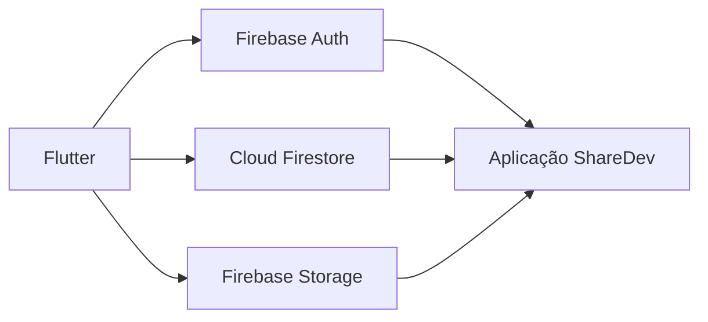
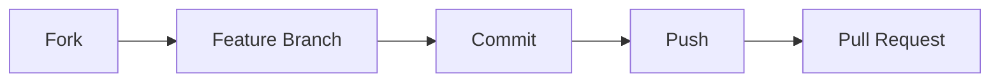

# 📸 ShareDev

### _Compartilhamento de Fotos | Flutter + Firebase_

[](https://flutter.dev)
[](https://firebase.google.com)
[](https://dart.dev)
[](LICENSE)

**Uma plataforma social moderna desenvolvida para demonstrar integração educacional entre Flutter e Firebase**

---

## 📋 Visão Geral

<table>
<tr>
<td width="50%">

### 🎯 O que é?

**ShareDev** é uma plataforma social de compartilhamento de imagens onde usuários podem criar contas, fazer upload de fotos com descrições, visualizar um feed de conteúdo, curtir e compartilhar imagens com outros usuários.

</td>
<td width="50%">

### 💡 Por quê?

Projeto desenvolvido com foco em **estudo e prática avançada** da integração Flutter + Firebase, demonstrando boas práticas de configuração, segurança via variáveis de ambiente e organização escalável.

</td>
</tr>
</table>

---

## ✨ Funcionalidades

<table>
<tr>
<td align="center" width="20%">
<br/>
<b>Autenticação</b><br/>
<sub>Email/Senha via Firebase Auth</sub>
</td>
<td align="center" width="20%">
<br/>
<b>Upload</b><br/>
<sub>Envio de imagens com descrição</sub>
</td>
<td align="center" width="20%">
<br/>
<b>Feed</b><br/>
<sub>Visualização de fotos em tempo real</sub>
</td>
<td align="center" width="20%">
<br/>
<b>Compartilhamento</b><br/>
<sub>Distribuição entre usuários</sub>
</td>
<td align="center" width="20%">
<br/>
<b>Like</b><br/>
<sub>Reação dos usuários a uma postagem</sub>
</td>
</tr>
</table>

---

## 🛠️ Stack Tecnológica



| Tecnologia           | Finalidade                | Versão Mínima |
| -------------------- | ------------------------- | ------------- |
| **Flutter**          | Framework multiplataforma | 3.0+          |
| **Dart**             | Linguagem de programação  | 2.17+         |
| **Firebase Auth**    | Autenticação de usuários  | -             |
| **Cloud Firestore**  | Banco de dados NoSQL      | -             |
| **Firebase Storage** | Armazenamento de mídia    | -             |

---

## 📦 Pré-requisitos

> ⚡ **Requisitos essenciais antes de começar**

- [x] [Flutter SDK](https://flutter.dev/docs/get-started/install) (versão 3.0 ou superior)
- [x] [Dart SDK](https://dart.dev/get-dart) (versão 2.17 ou superior)
- [x] Projeto criado no [Firebase Console](https://console.firebase.google.com/)
- [x] Editor de código (VS Code, Android Studio, etc.)

> 💡 **Firebase CLI é opcional** — necessário apenas para Hosting, Emulators ou FlutterFire CLI

---

## ⚙️ Configuração do Projeto

### 1️⃣ Clone o Repositório

```bash
git clone https://github.com/L4r1ss4Cr4v0/ShareDev.git
cd sharedev
```

### 2️⃣ Instale as Dependências

```bash
flutter pub get
```

### 3️⃣ Configure o Firebase

<details>
<summary><b>📱 Passos no Firebase Console</b></summary>

1. Acesse o [Firebase Console](https://console.firebase.google.com/)
2. Crie um novo projeto ou selecione um existente
3. Ative os seguintes serviços:
   - ✅ **Authentication** (Email/Password)
   - ✅ **Cloud Firestore**
   - ✅ **Firebase Storage**
4. Registre seus apps (Android, iOS e/ou Web)
5. Copie as credenciais de cada plataforma

</details>

> ⚠️ **Importante:** Este projeto **NÃO versiona** arquivos `google-services.json` ou `GoogleService-Info.plist`. Toda configuração é feita via **variáveis de ambiente**.

---

## 🔐 Variáveis de Ambiente

<div align="center">

### 🎯 Sistema de Configuração via `--dart-define`

</div>

O ShareDev utiliza variáveis de ambiente para máxima segurança e flexibilidade entre ambientes.

### 🌍 Variáveis Universais

> Necessárias em **todas as plataformas**

| Variável                       | Descrição                | Exemplo                   |
| ------------------------------ | ------------------------ | ------------------------- |
| `FIREBASE_PROJECT_ID`          | ID do projeto Firebase   | `meu-projeto-123`         |
| `FIREBASE_MESSAGING_SENDER_ID` | Sender ID para mensagens | `123456789012`            |
| `FIREBASE_STORAGE_BUCKET`      | Bucket do Storage        | `meu-projeto.appspot.com` |

---

### 🌐 Configuração Web

| Variável               | Obrigatória | Onde Encontrar                                    |
| ---------------------- | :---------: | ------------------------------------------------- |
| `FIREBASE_API_KEY_WEB` |     ✅      | Firebase Console → Configurações do Projeto → Web |
| `FIREBASE_APP_ID_WEB`  |     ✅      | Firebase Console → Configurações do Projeto → Web |
| `FIREBASE_AUTH_DOMAIN` |     ✅      | `seu-projeto.firebaseapp.com`                     |

> 🔒 **Nota de Segurança:** No Flutter Web, as chaves ficam expostas no bundle. Use **Firebase Security Rules** para proteção real.

---

### 🤖 Configuração Android

| Variável                   | Obrigatória | Onde Encontrar                                                   |
| -------------------------- | :---------: | ---------------------------------------------------------------- |
| `FIREBASE_API_KEY_ANDROID` |     ✅      | `google-services.json` → `client[].api_key[].current_key`        |
| `FIREBASE_APP_ID_ANDROID`  |     ✅      | `google-services.json` → `client[].client_info.mobilesdk_app_id` |

---

### 🍎 Configuração iOS / macOS

| Variável                 | Obrigatória | Onde Encontrar                               |
| ------------------------ | :---------: | -------------------------------------------- |
| `FIREBASE_API_KEY_IOS`   |     ✅      | `GoogleService-Info.plist` → `API_KEY`       |
| `FIREBASE_APP_ID_IOS`    |     ✅      | `GoogleService-Info.plist` → `GOOGLE_APP_ID` |
| `FIREBASE_IOS_BUNDLE_ID` |     ✅      | `GoogleService-Info.plist` → `BUNDLE_ID`     |

---

## ▶️ Como Executar

<details open>
<summary><b>🤖 Android (Emulador ou Device Físico)</b></summary>

```bash
flutter run \
  --dart-define=FIREBASE_PROJECT_ID=seu_project_id_aqui \
  --dart-define=FIREBASE_MESSAGING_SENDER_ID=seu_sender_id_aqui \
  --dart-define=FIREBASE_STORAGE_BUCKET=seu_bucket_aqui \
  --dart-define=FIREBASE_API_KEY_ANDROID=sua_api_key_android_aqui \
  --dart-define=FIREBASE_APP_ID_ANDROID=seu_app_id_android_aqui
```

</details>

<details>
<summary><b>🌐 Web (Chrome)</b></summary>

```bash
flutter run -d chrome \
  --dart-define=FIREBASE_PROJECT_ID=seu_project_id_aqui \
  --dart-define=FIREBASE_MESSAGING_SENDER_ID=seu_sender_id_aqui \
  --dart-define=FIREBASE_STORAGE_BUCKET=seu_bucket_aqui \
  --dart-define=FIREBASE_AUTH_DOMAIN=seu_auth_domain_aqui \
  --dart-define=FIREBASE_API_KEY_WEB=sua_api_key_web_aqui \
  --dart-define=FIREBASE_APP_ID_WEB=seu_app_id_web_aqui
```

</details>

<details>
<summary><b>🍎 iOS / macOS</b></summary>

```bash
flutter run \
  --dart-define=FIREBASE_PROJECT_ID=seu_project_id_aqui \
  --dart-define=FIREBASE_MESSAGING_SENDER_ID=seu_sender_id_aqui \
  --dart-define=FIREBASE_STORAGE_BUCKET=seu_bucket_aqui \
  --dart-define=FIREBASE_API_KEY_IOS=sua_api_key_ios_aqui \
  --dart-define=FIREBASE_APP_ID_IOS=seu_app_id_ios_aqui \
  --dart-define=FIREBASE_IOS_BUNDLE_ID=seu_bundle_id_ios_aqui
```

</details>

---

## 🏗️ Build para Produção

### 🤖 Android APK

```bash
flutter build apk --release \
  --dart-define=FIREBASE_PROJECT_ID=seu_project_id_aqui \
  --dart-define=FIREBASE_MESSAGING_SENDER_ID=seu_sender_id_aqui \
  --dart-define=FIREBASE_STORAGE_BUCKET=seu_bucket_aqui \
  --dart-define=FIREBASE_API_KEY_ANDROID=sua_api_key_android_aqui \
  --dart-define=FIREBASE_APP_ID_ANDROID=seu_app_id_android_aqui
```

### 🍎 iOS

```bash
flutter build ios --release \
  --dart-define=FIREBASE_PROJECT_ID=seu_project_id_aqui \
  --dart-define=FIREBASE_MESSAGING_SENDER_ID=seu_sender_id_aqui \
  --dart-define=FIREBASE_STORAGE_BUCKET=seu_bucket_aqui \
  --dart-define=FIREBASE_API_KEY_IOS=sua_api_key_ios_aqui \
  --dart-define=FIREBASE_APP_ID_IOS=seu_app_id_ios_aqui \
  --dart-define=FIREBASE_IOS_BUNDLE_ID=seu_bundle_id_ios_aqui
```

---

## 🗂️ Estrutura do Projeto

```
sharedev/
│
├── lib/
│   ├── config/
│   │   └── firebase_config.dart  # 🔧 Configurações Firebase via dart-define
│   ├── screens/                  # 📱 Telas da aplicação
│   ├── widgets/                  # 🧩 Componentes reutilizáveis
│   └── main.dart                 # 🚀 Entry point
│
├── android/                      # 🤖 Configurações Android
├── ios/                          # 🍎 Configurações iOS
├── web/                          # 🌐 Configurações Web
│
└── pubspec.yaml                  # 📦 Dependências
```

---

## 🔒 Segurança

<table>
<tr>
<td width="33%" align="center">
<b>❌ Nunca Versionar</b><br/>
<sub>Credenciais sensíveis</sub>
</td>
<td width="33%" align="center">
<b>✅ Usar .env*</b><br/>
<sub>Apenas localmente</sub>
</td>
<td width="33%" align="center">
<b>🛡️ Security Rules</b><br/>
<sub>Firestore e Storage</sub>
</td>
</tr>
</table>

### 📄 Exemplo de `.gitignore`

```gitignore
# Variáveis de ambiente
.env*
!.env.example

# Configurações Firebase
google-services.json
GoogleService-Info.plist

# Build artifacts
build/
```

---

## 🤝 Contribuindo

<div align="center">

**Contribuições são muito bem-vindas!** 🎉

</div>



1. **Fork** o projeto
2. Crie uma **feature branch** (`git checkout -b feature/minha-feature`)
3. **Commit** suas alterações (`git commit -m 'feat: adiciona nova feature'`)
4. **Push** para o fork (`git push origin feature/minha-feature`)
5. Abra um **Pull Request**

---

<div align="center">

### 💡 Nota Final

> **ShareDev** é um projeto educacional focado em demonstrar boas práticas de integração entre Flutter e Firebase, com atenção especial à **organização**, **segurança** e **escalabilidade**.

---

</div>
